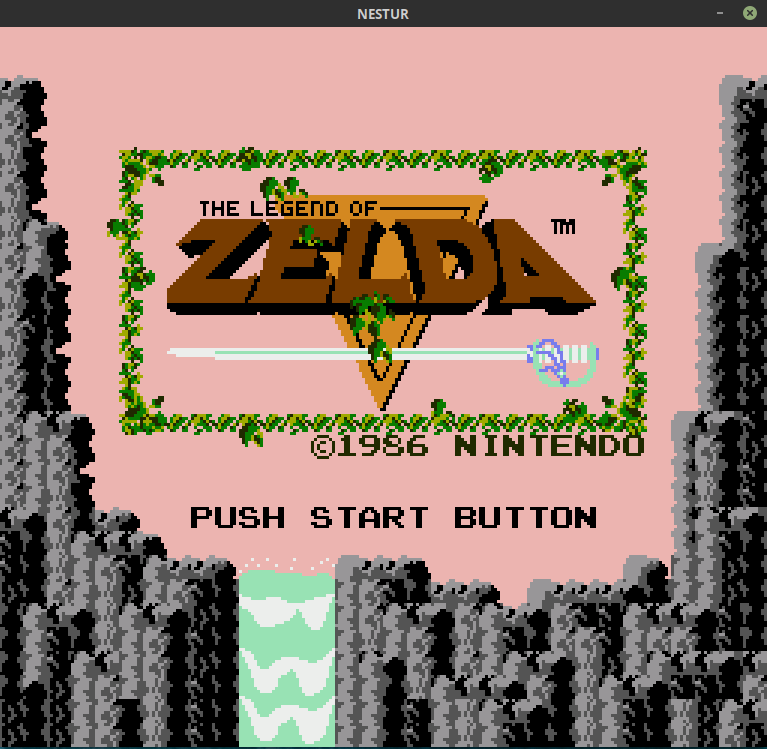

# nestur

This is an NES emulator and a work in progress. There are still some minor bugs and the audio is kind of scratchy. I've mostly tested on Donkey Kong, Super Mario Bros., and Zelda so far. There are plenty of full-featured emulators out there; this is primarily an educational project but I do want it to run well. SDL2 is the only dependency, it's NTSC timing, and contains no `unsafe` code.

  

## Controls:
```
 Button  |   Key
___________________
|   A    |    D   |
|   B    |    F   |
| Start  |  Enter |
| Select | R-Shift|
|   Up   |   Up   |
|  Down  |  Down  |
|  Left  |  Left  |
|  Right |  Right |
-------------------
```
The code aims to follow the explanations from the [NES dev wiki](https://wiki.nesdev.com/w/index.php/NES_reference_guide) where possible, especially in the PPU, and the comments quote from it often. Thanks to everyone who contributes to that wiki/forum, and to Michael Fogleman's [NES](https://github.com/fogleman/nes) and Scott Ferguson's [Fergulator](https://github.com/scottferg/Fergulator) for getting me unstuck at several points.

## To do:

- More mappers (only mappers 0 (NROM) and 1 (MMC1) implemented so far)

- DMC audio channel, high- and low-pass filters, APU cleanup/timing fix

- Save/load functionality and battery-backed RAM solution

- Player 2 controller?


Please also check out [Cloaker](https://github.com/spieglt/cloaker) and [Flying Carpet](https://github.com/spieglt/flyingcarpet)!
