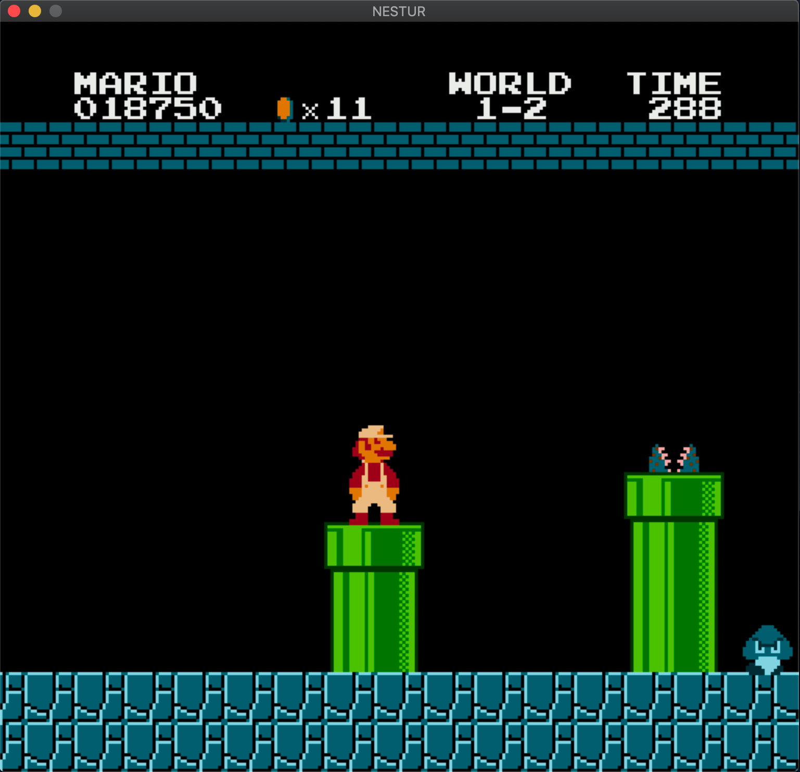
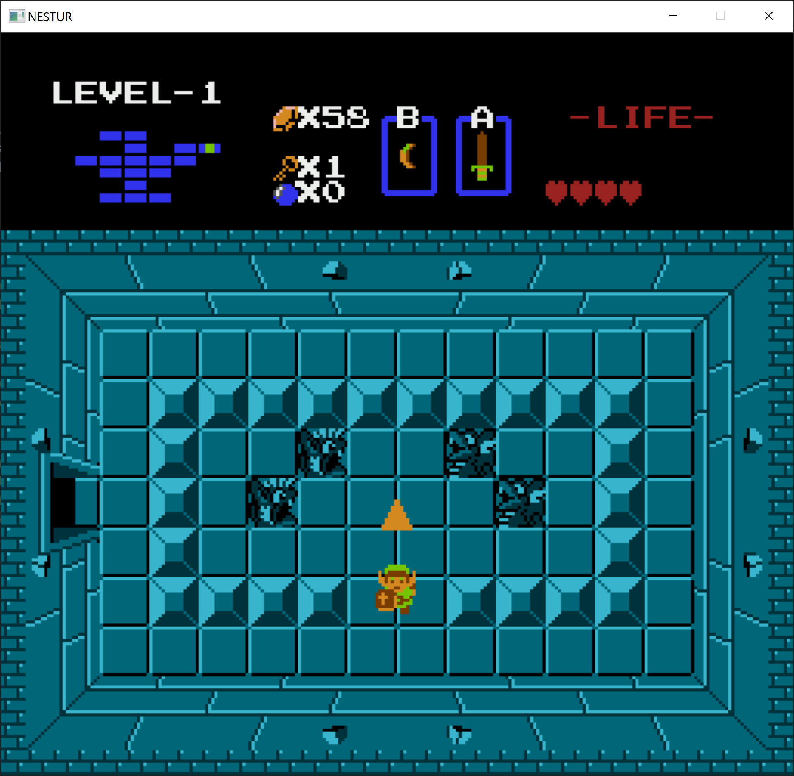
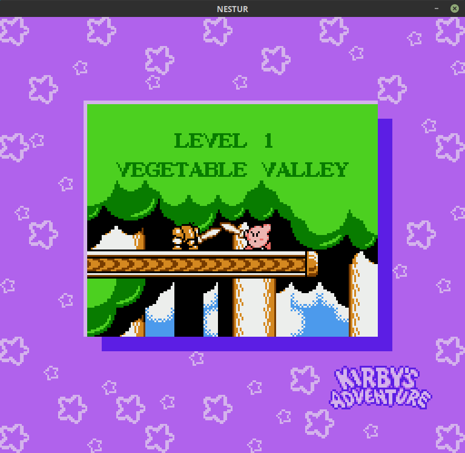
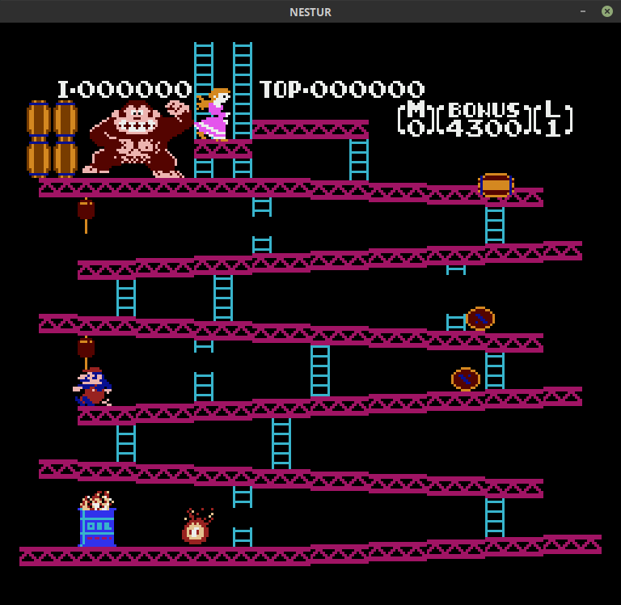
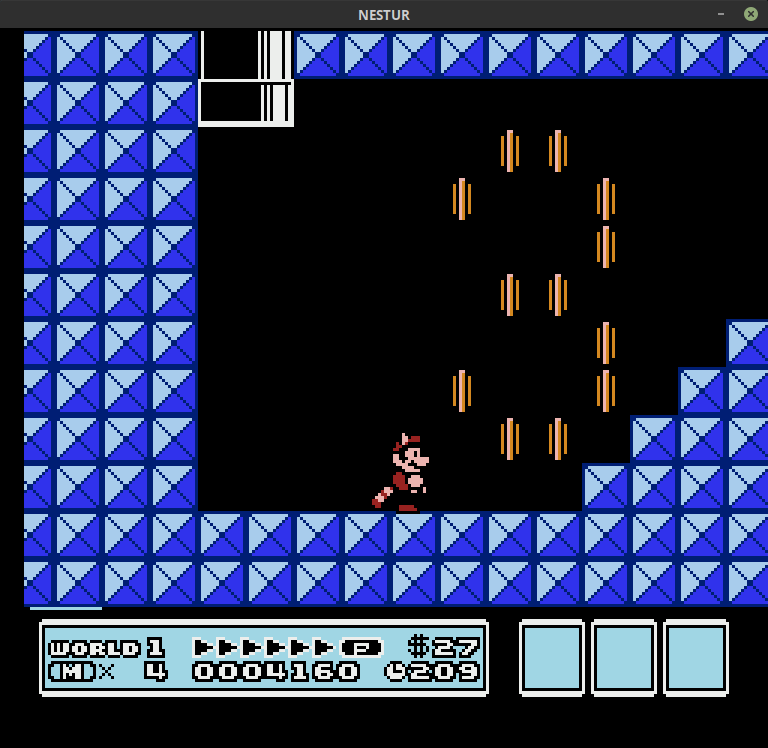
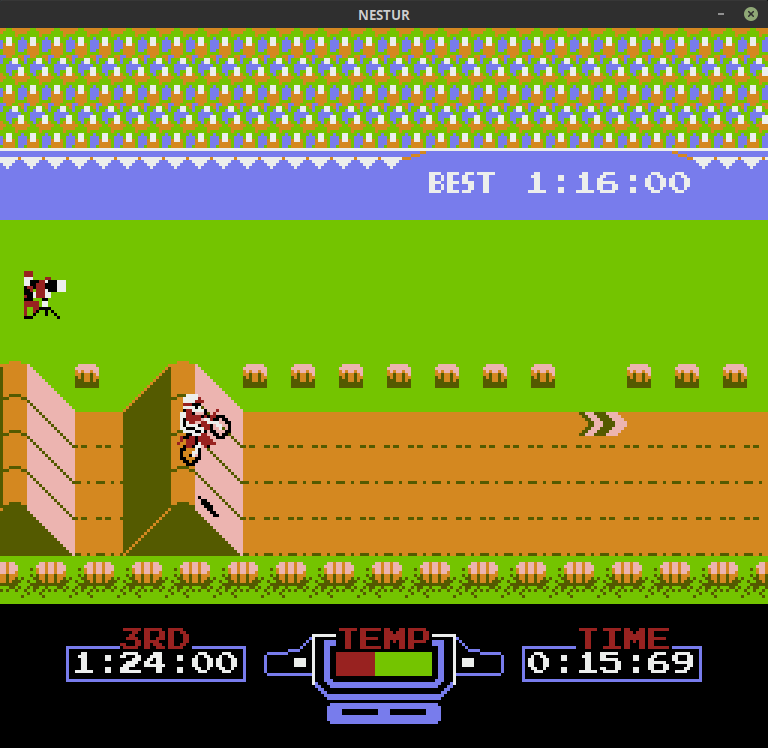

# nestur

Nestur is an NES emulator. There are plenty of full-featured emulators out there; this is primarily an educational project but it is usable. There may still be many bugs, but I'm probably not aware of them so please submit issues.
- SDL2 is the only dependency
- no use of `unsafe`
- NTSC timing
- supports mappers 0-4 which cover ~85% of [games](http://tuxnes.sourceforge.net/nesmapper.txt)

     

## Controls
```
 Button  |   Key
___________________
|   A    |    D   |
|   B    |    F   |
| Start  |  Enter |
| Select | R-Shift|
|   Up   |   Up   |
|  Down  |  Down  |
|  Left  |  Left  |
|  Right |  Right |
-------------------
```
The code aims to follow the explanations from the [NES dev wiki](https://wiki.nesdev.com/w/index.php/NES_reference_guide) where possible, especially in the PPU, and the comments quote from it often. Thanks to everyone who contributes to that wiki/forum, and to Michael Fogleman's [NES](https://github.com/fogleman/nes) and Scott Ferguson's [Fergulator](https://github.com/scottferg/Fergulator) for getting me unstuck at several points.

## Compilation and use

1. Install [Rust](https://www.rust-lang.org/tools/install)
2. Configure SDL2 for your platform:
    - Windows: `SDL2.dll` is already in the repo so you don't have to do anything
    - macOS: Install [Homebrew](https://brew.sh/) and run `brew install sdl2`
    - Linux: `sudo apt-get install libsdl2-dev` (or whatever your package manager is)
3. `cd nestur/ && cargo build --release` (be sure to build/run with the release flag or it will run very slowly)
4. The `nestur` executable or `nestur.exe` will be in `nestur/target/release`.
5. Run with `$ ./nestur path/to/rom_filename.nes` or `> nestur.exe path\to\rom_filename.nes`.
6. If the game uses battery-backed RAM (if it can save data when turned off), a save file like `rom_filename.sav` will be created in the same folder as the ROM when the program is exited. When Nestur is run again, it will look for a file matching the ROM name, with a `.sav` extension instead of `.nes`.

## To do

- DMC audio channel, high- and low-pass filters

- Better GUI and distributable solution

- Save states

- Player 2 controller?

## Known problem games

- Paperboy: input doesn't work


Please also check out [Cloaker](https://github.com/spieglt/cloaker) and [Flying Carpet](https://github.com/spieglt/flyingcarpet)!
